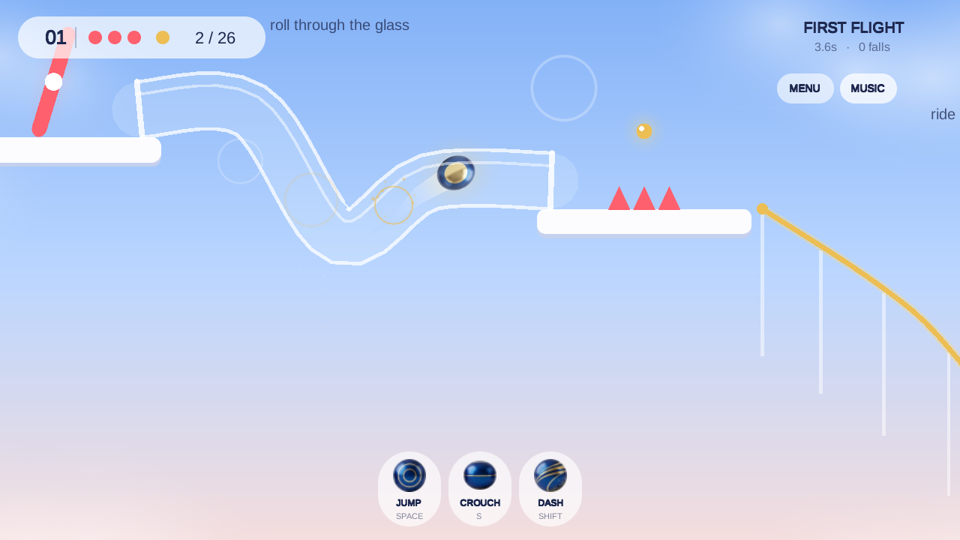
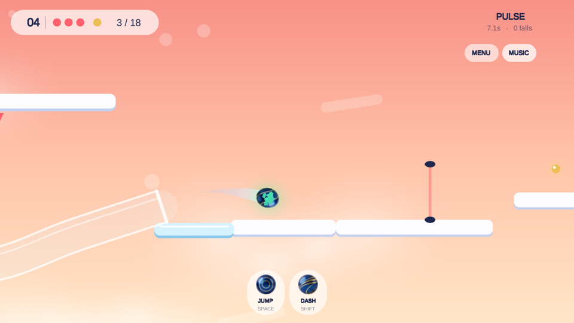
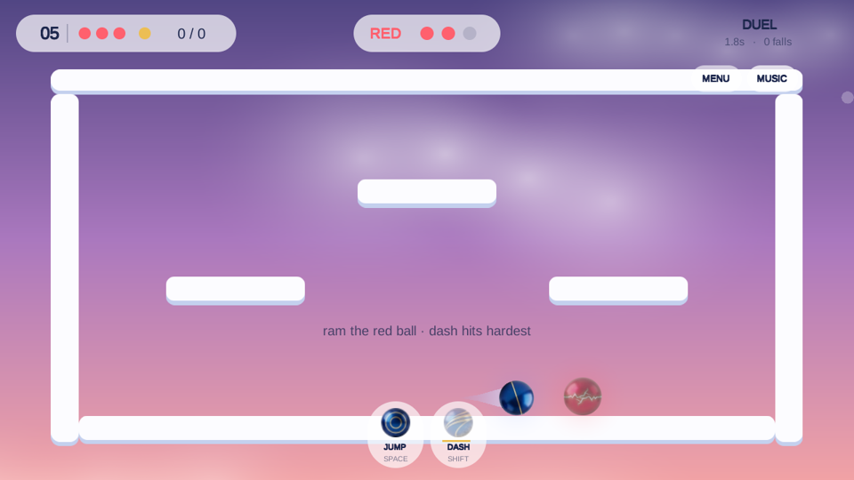

# SKYROLL

A minimal physics game in **Unity 2022.3 (WebGL)**. You roll a glossy ball across floating platforms in the sky and change its state (dash, grow, reverse gravity, climb) to get past rails, glass tubes, ice and pulsing lasers. Levels 5 and 10 are boss duels against a red rival ball.

**Play:** https://slavastar.itch.io/game (desktop, or iPhone in Safari held sideways)

| | |
|---|---|
|  |  |
|  | |

## Main concepts
- **Physics feel:** Unity 2D physics (Box2D) plus squash and stretch, hit-stop, screen shake and particles.
- **Ball states:** each ability swaps the ball's sprite. The sprites are cut from our own concept art.
- **10 levels:** you can pick any of them from the menu. Levels 1–5 use 2 abilities besides jump; levels 6–10 use 3, including SLAM and HOVER.
- **Levels 6–9:** trampolines, gravity-flip fields, glass floors to slam through, loop-the-loop rails and a different mix of rail shapes in every finale.
- **Levels 11–15:** BOUNCE HOUSE (spring chains under spike ceilings), BLIND DROP (hidden three-tube squeeze maze, one safe exit), GHOST LINE (new PHASE state, V), SKYFALL (slam launches, blue rain, SHIELD on J) and CRIMSON RIFT, a final boss over a bottomless rift with blue push shots and bullet rain.
- **More traps:** blue blasters whose shots ricochet and knock you back (some swivel), cyan frost lines that freeze you for 3 s of drifting, orange speed kickers over chasms, tilted green pads, and loops of different shapes (tall, flat, double corkscrew). Level endings vary: rail runs, tube drops, pad hops, loop dives.
- **Boss 2 (level 10):** a new arena with springs and a U-rail. The rival fires homing orbs, bullet rings and quake shockwaves.
- **Lasers:** red lasers cost a life, blue lasers only push you back.
- **Boss:** a single fixed screen with 4 lives each. Ram the red ball to take one of its lives. It fights back by shooting, dashing, growing and teleporting.
- **Music:** calm music for each level, synthesised in code. Press `M` to mute.
- **Mobile:** fixed ◀ ▶ pads, a JUMP button and buttons for the level's abilities. A rotate screen appears in portrait.

## Controls
`←/→` roll · `Space` jump · `S` crouch · `D` dash · `F` slam · `Q` hover · `E` reverse gravity · `G` grow · `R` restart · `L` level menu · `M` music

## Run locally
```bash
cd webgl && python3 -m http.server 8091   # open http://localhost:8091
```

## Build and deploy
```bash
cd unity
Unity -batchmode -nographics -quit -projectPath . -buildTarget WebGL \
      -executeMethod BuildWebGL.Build -logFile build.log   # outputs ../webgl
butler push ../webgl slavastar/game:html                     # itch.io
```
Open `unity/` in Unity Hub (2022.3.45f1 with WebGL support). The whole game is generated from C# at runtime (see `unity/Assets/Scripts`).

## Stack
Unity 2022.3 · C# · Physics2D · IMGUI · procedural audio (`AudioClip.Create`) · Python/Pillow for sprites · butler and GitHub Actions for itch.io.

More detail: [docs/TECHNICAL.md](docs/TECHNICAL.md).
